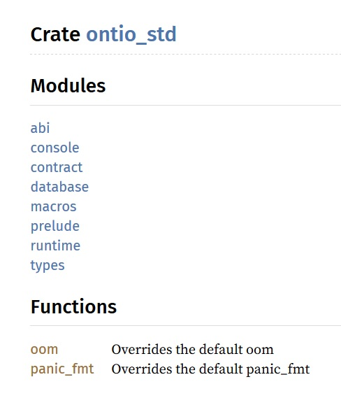

# Creating your own project

Using templates is convenient but it might limit certain dimensions of the development process. 

So, let us write a contract from scratch and test it. This will be more helpful for developers who are familiar with smart contract development but are just getting started with Ontology `WASM` smart contracts.

## Create a new smart contract

We create a new library, so to speak, to start implementing a new smart contract. Navigate to the appropriate directory and execute the following code-

```bash
cargo new --lib helloworld
```

If successfully executed, the file hierarchy of the new library would look like so-

```bash
.
├── Cargo.toml
└── src
    └── lib.rs
```

As you may have noticed, a rust based `WASM` contract consists of two components, one being the `Cargo.toml` file and the other being the `src/lib.rs` rust file that is used to write and implement contract logic.

## Generate the ontio-std API file

Before generating the API file, we need to edit the `Cargo.toml` file to add certain dependencies and libraries that will be used later.

First, under the `[dependencies]` configuration, include the Ontology `WASM` contract toolkit. Also, since we will compiling the contract in a form that is different from the standard, we need to add `[lib]` configuration settings. 

The `[features]` configuration is used to toggle certain unstable features. Please note that these features can only be compiled using the nightly compiler. 

A complete `Cargo.toml` would look something like-

```yaml
[package]
name = "helloworld"
version = "0.1.0"
authors = ["Lucas <sishsh@163.com>"]
edition = "2018"

# See more keys and their definitions at https://doc.rust-lang.org/cargo/reference/manifest.html
[lib]
crate-type = ["cdylib"]
path = "src/lib.rs"
[dependencies]
ontio-std = {git="https://github.com/ontio/ontology-wasm-cdt-rust.git"}

[features]
mock = ["ontio-std/mock"]
```

We still do not know the `APIs` that we can use from the toolkit that we just included in the project dependencies.

The following command can be used to generate the `API` documentation for this library.

```bash
cargo doc
```

After successful execution of the above command the project structure would be as follows-

```bash
.
├── Cargo.lock
├── Cargo.toml
├── src
│   └── lib.rs
└── target
    ├── debug
    └── doc
```

The API documentation can be found in the `doc` directory. The `settings.html` file can be opened using a web browser. The reference for `ontio-std` library looks like-




Libraries are referred to as **crates** in the context of `Rust`.


## Writing the contract logic

The `src/lib.rs` file that was generated when we created a new library has the following contents by default-

```rust
#[cfg(test)]
mod tests {
    #[test]
    fn it_works() {
        assert_eq!(2 + 2, 4);
    }
}
```

The is some test code included. You can test this code by executing the `cargo test` command under the `root` directory.

We can now proceed with writing our logic by editing this file.

First, we import the `ontio-std` library added in the `Cargo.toml` dependencies. We use the `#![no_std]` annotation so as to prevent rust from using the standard library. 

```rust
#![no_std]
extern crate ontio_std as ostd;

#[cfg(test)]
mod tests {
    #[test]
    fn it_works() {
        assert_eq!(2 + 2, 4);
    }
}
```

Then we add an invoke function that acts as the main\(\) for all intents and purposes. We also import the `APIs` that will allow us to carry out parameter I/O.

```rust
#![no_std]
extern crate ontio_std as ostd;
use ostd::abi::{Sink, Source};
use ostd::prelude::*;
use ostd::runtime;

fn say_hello(msg: &str) -> String {
    return msg.to_string();
}

#[no_mangle]
fn invoke() {
    let input = runtime::input();
    let mut source = Source::new(&input);
    let action: &[u8] = source.read().unwrap();
    let mut sink = Sink::new(12);
    match action {
        b"hello" => {
        let msg = source.read().unwrap();
        sink.write(say_hello(msg));
        },
        _ => panic!("unsupported action!"),
    }
    runtime::ret(sink.bytes())
}

#[test]
fn test_hello() {

    let res = say_hello("hello world");
    assert_eq!(res, "hello world".to_string());
}
```

Here, `Sink` and `Source` objects have been imported. `Source` allows us to fetch the parameters and data that is passed when the contract is invoked externally. `Sink` is used to serialize data of different formats to the `bytearray` format.

The `prelude` module of `ontio-std` provides a few commonly used functions that perform data conversion  as `Address`, `U128`, `String`, etc., apart from other useful functions.

The `runtime` `API` contains functions that are used to interact with the blockchain and the application end. For example, the `runtime::ret()` method is used to return the result of contract execution. 

The `#[no_mangle]` annotation instructs the compiler not obscure the main function while compiling it to ensure that Ontology's build tools can work with the bytecode that is generated post-compilation.

With this, the basic methods that allow us to interact with the contract are in place. The contract can now be compiled.

## Compiling the contract

The code needs to be compiled and converted to `WASM` `bytecode` to be deployed on the chain. The following command can be used to compile a contract.

```bash
RUSTFLAGS="-C link-arg=-zstack-size=32768" cargo build --release --target wasm32-unknown-unknown
```

The  `RUSTFLAGS="-C link-arg=-zstack-size=32768"` directive is used to set the maximum allowed stack size to 32KB. The default size of the `rustc` compiler stack is 1MB, which is very wasteful as far as smart contracts are concerned. `wasm32-unknown-unknown` indicates that the target bytecode be generated using the `11VM` back end compiler. It generates better and more sophisticated code than the `emscripten` compiler.

Once the above code is successfully executed the target directory will look like-

```bash
.
├── release
│   ├── build
│   ├── deps
│   ├── examples
│   └── incremental
└── wasm32-unknown-unknown
    └── release
```

For our example, the file generated can be found in the `wasm32-unknown-unknown/release` folder under the `target` directory with the file name `helloworld.wasm`

The `bytecode` file generated post compilation tends to be large in size, and thus if deployed on to the chain in it's current form, a large amount of space would be required to store it, implying higher costs. To optimize storage, we use the `ontio-wasm-build` tool to optimize the `bytecode` and compress it. 


More details for those curious about `ontio-wasm-build` can be found by following [this](https://github.com/ontio/ontio-wasm-build) link.


The tools can be used by executing the following command with the `WASM` `bytecode` file-

```bash
ontio-wasm-build helloworld.wasm helloworld_optimized.wasm
```

The file with the optimized `bytecode` goes by the name of `helloworld_optimized`. Another file with a `.str` extension will also be generated. While deploying the contract we will be using this string file that contains hex code obtained by converting the bytecode, since we are carrying out this entire process using a `CLI` \(Command Line Interface\). 

## Deploying and Invoking the contract

To able to perform any transaction related operations we will first need to deploy our private test node, and a private test node requires a wallet file to work with. Here we make a new account and generate a `.dat` wallet file. Navigate to the Ontology root directory and execute the following command.

```bash
./ontology account add
```

Next, open a new terminal window and run the following command to start the private node. 

```text
./ontology --testmode --loglevel 1
```

`--testmode` selects the test mode to start the node, and `--loglevel 1` selects the debug mode so that the debug information gets recorded in the logs section for us to refer to, as and when needed. 

We need to ensure that this particular window stays up and running in the background since this is what serves as our private node, practically speaking.

Then, return to the original window and execute the following command to deploy the contract.

```bash
./ontology contract deploy --vmtype 3 --code ./helloworld.wasm.str --name helloworld --author "author" --email "email" --desc "desc" --gaslimit 22200000
```

Let us go through the series of options used here one by one.

| Option | Value | Description |
| :---: | :---: | :--- |
| --vmtype | 3 | The VM type to be used to run the contract |
| --code | Path | Path of the file containing the bytecode  |
| --name | String | Name of the smart contract |
| --author | String | Name of the author of the smart contract |
| --email | Email address | Email address of the contract author |
| --desc | String | Brief description of the contract's function |
| --gaslimit | Integer | Gas limit to calculate the Gas cost for deploying the smart contract |

After the deploy command, `--vmtype 3` indicates that the contract is a `WASM` contract. We specify this  since apart from `WASM` contracts, Ontology also supports `NeoVM` smart contract development in `Python` and `C#`. Interested developers feel free to check out the the relevant details.

Finally, if the contract was deployed successfully, we can proceed to invoke the contract using the contract details.

The `invoke()` function serves as the entry point for a smart contract. Any other functions that we may define in the scope of the contract can be called by passing parameters to the `invoke()` function and then calling the respective function from within `invoke()`. The functions that are defined under the `#[test]` annotation can be run locally from the IDE to test logic.

When we invoke the invoke\(\) function here,  it will return a "hello world" if the contract is invoked successfully, since the function we're calling is hello, and we have passed the string "hello world" as parameters. We just need to ensure that we use the `--prepare` option when invoking the contract. This means that we are pre-executing it, the reason for which being the result returned by the contract will not be displayed if we invoke and run the contract directly. 


More details on contract invocation and CLI operation in general can be found [here](https://github.com/ontio/ontology/blob/master/docs/specifications/cli_user_guide.md).


The command is as follows-

```text
./ontology contract invoke --address 913ea5298565123847ffe61ec93986a52e824a1b --vmtype 3 --params 'string:hello,string:hello world' --version 0 --prepare
```

If the executed successfully, **68656c6c6f20776f726c64** along with the transaction hash will be returned in the command line. The value is in fact "hello world" in hexadecimal. 

You now have the fundamental understanding of Ontology's WASM contracts such that you can develop your own smart contracts and implement complex logic.

